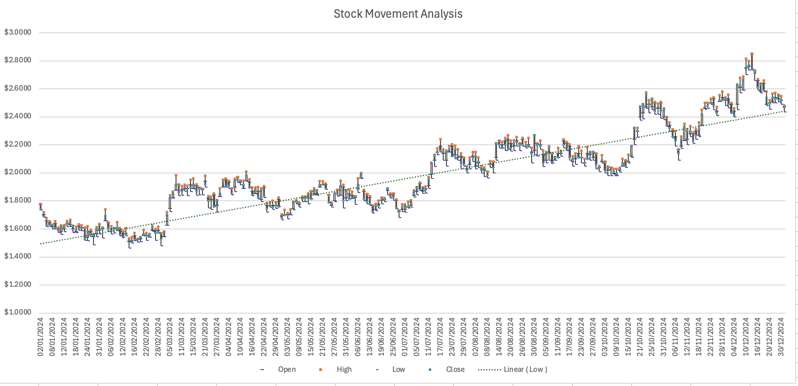
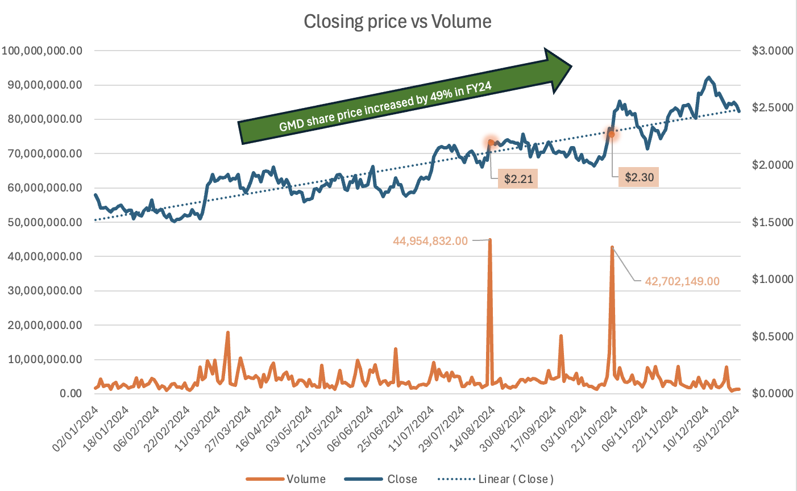
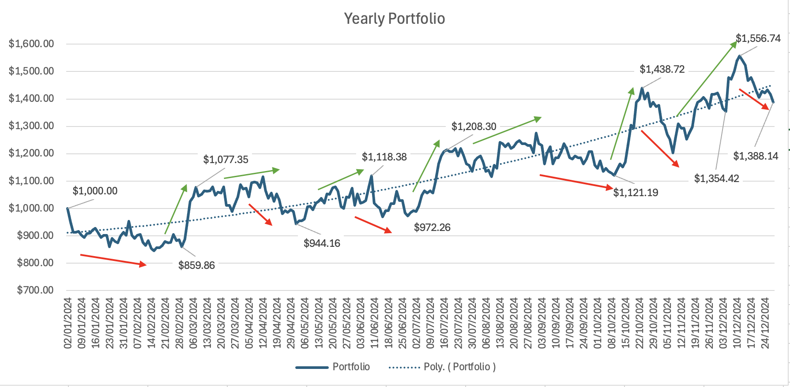
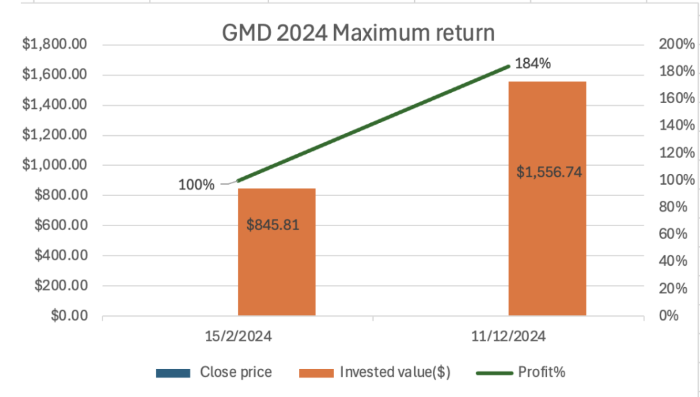
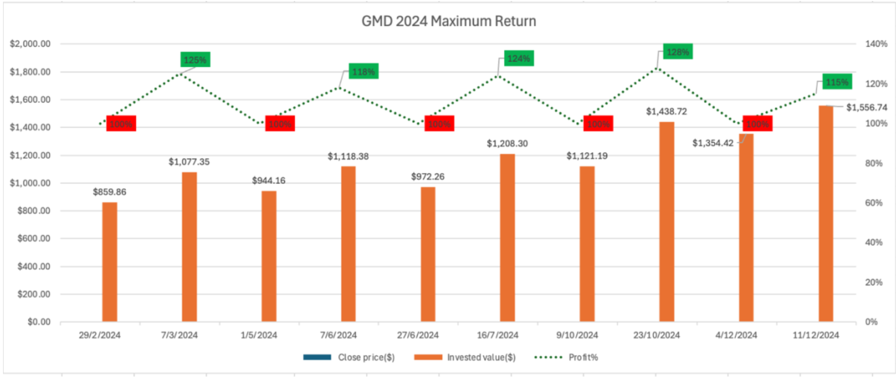
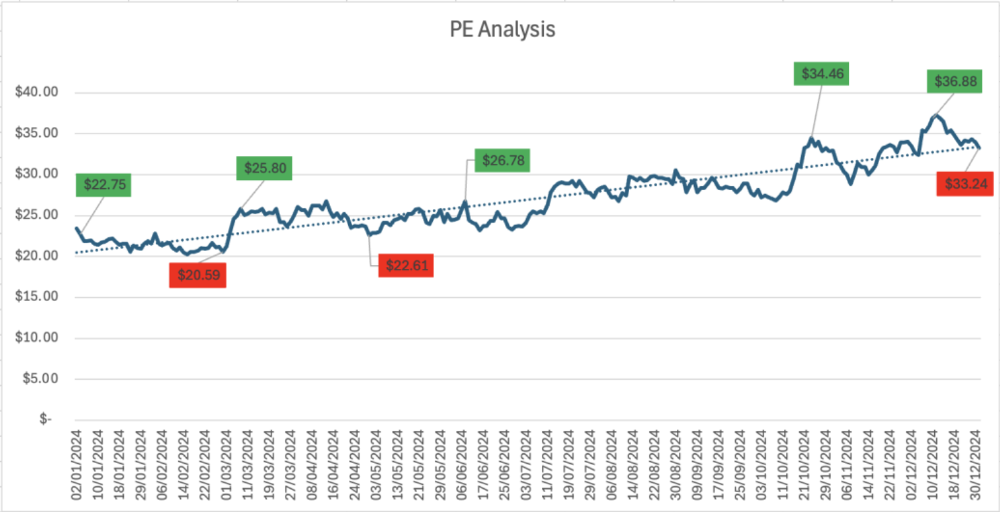
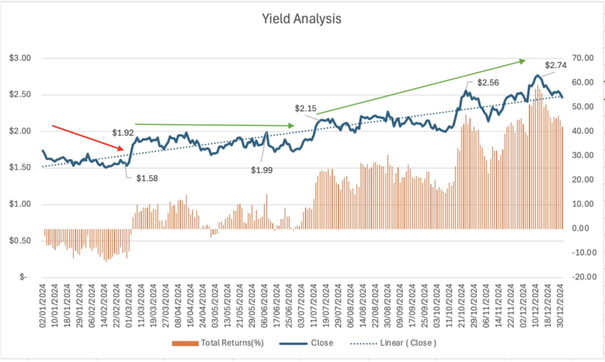

# Australia Import–Export Visual Analytics: Trade Patterns, Category Analysis & Export Forecasting

---

<p>
  
  
  
  
  
  
</p>

---

## 📌 Project Information

**Author:** Ali Abbas  
**Course:** Data Visualisation & Visual Analytics  
**Project Type:** Trade Data Analytics & Forecasting  
**Focus Area:** Australia Import–Export Trade (Category 6 & Subcategory 68)  
**Tools Used:** Excel, Tableau  
**Year:** 2025  

---


# 📊 ASX Stock Market Visual Analytics  
## Strategic Insights & Performance Analysis — GMD Stock (ASX)

---

## 📌 Project Overview

This project presents a **stakeholder-level visual analytics study** of GMD stock performance on the Australian Securities Exchange (ASX).  

Using Excel-based financial analysis and data storytelling, the project transforms historical trading data into clear insights covering:

- Stock price behaviour  
- Trading volume dynamics  
- Portfolio growth performance  
- Market capitalisation trends  
- Valuation metrics (P/E ratio)  
- Yield and return movement  

The analysis is designed to communicate insights clearly to investors and decision-makers rather than focusing on complex modelling.

---

## 🧠 Executive Summary

GMD demonstrated strong bullish behaviour throughout FY2024 with consistent price appreciation supported by high trading volume. Portfolio simulations show significant growth potential despite temporary corrections, while valuation and yield metrics suggest increasing investor confidence.

**Key outcomes:**

- Sustained upward price trend during FY2024  
- Volume-supported momentum during growth phases  
- Portfolio value increased significantly over the year  
- Market capitalisation growth driven by price appreciation  
- P/E and yield trends indicate improving market sentiment  

Overall, the data suggests strong medium-term performance with recurring trading opportunities.

---

## 🧩 Business Problem

Investors often struggle to interpret large volumes of stock market data and identify:

- When momentum shifts occur  
- Whether price growth is supported by market activity  
- If valuation metrics remain healthy during growth phases  
- How investment returns evolve through time  

This project addresses the question:

> **How did GMD perform across FY2024, what drove its performance, and what insights can stakeholders extract from price, volume, and valuation behaviour?**

---

## 🎯 Analytical Objectives

- Analyse overall stock trend direction and volatility  
- Study price vs volume relationships  
- Evaluate portfolio return performance  
- Examine market capitalisation vs issued shares  
- Analyse valuation using PE ratio trends  
- Assess yield and return efficiency  

---

## 🧰 Tools & Methodology

### Tools Used
- Microsoft Excel  
- Financial chart engineering  
- Trendline analysis  
- Stakeholder-focused visual storytelling  

### Methodology
1. Data cleaning and structuring in Excel  
2. Financial ratio and trend analysis  
3. Portfolio performance simulation  
4. Visualization-driven insight generation  

---

# 📊 Visual Storytelling & Analysis

---

## 1️⃣ Stock Movement Analysis



**Insight:**  
The stock shows a clear upward trajectory with periodic corrections, indicating strong long-term bullish momentum.

**Stakeholder Interpretation:**  
Long-term growth dominates short-term volatility.

---

## 2️⃣ Price vs Volume Analysis



**Insight:**  
Major price increases align with strong trading volume spikes.

**Stakeholder Interpretation:**  
Volume confirms price momentum and signals strong market participation.

---

## 3️⃣ Portfolio Returns Journey



**Insight:**  
Portfolio value grows steadily throughout FY2024 despite short-term pullbacks.

**Stakeholder Interpretation:**  
Long-term positioning benefits investors despite temporary corrections.

---

## 4️⃣ Capital vs Issued Shares Analysis


**Insight:**  
Market capitalisation increases while issued shares remain relatively stable.

**Stakeholder Interpretation:**  
Growth is primarily driven by valuation and price appreciation rather than dilution.

---

## 5️⃣ One-Year Maximum Return



**Insight:**  
Investment value increased significantly over the year, showing strong maximum-return potential.

**Stakeholder Interpretation:**  
High upside potential for medium-term investors.

---

## 6️⃣ Maximum Trade Analysis



**Insight:**  
Multiple high-return trade windows are visible throughout the year.

**Stakeholder Interpretation:**  
Momentum cycles provided repeated profitable opportunities.

---

## 7️⃣ PE Ratio Analysis



**Insight:**  
PE ratio trends upward alongside price increases.

**Stakeholder Interpretation:**  
Investor confidence and growth expectations strengthened across FY2024.

---

## 8️⃣ Yield Analysis



**Insight:**  
Yield performance improves toward later stages of the year.

**Stakeholder Interpretation:**  
Return efficiency increases as trend maturity develops.

---

# 📈 Key Stakeholder Takeaways

- GMD displayed strong upward momentum across FY2024.  
- Volume confirmed major price movements.  
- Portfolio performance indicates strong long-term returns.  
- Valuation metrics suggest increasing market confidence.  
- Multiple momentum-driven trade opportunities existed.  

---

## 🚀 Future Improvements

- Add predictive forecasting models  
- Include risk metrics (Sharpe Ratio, Beta)  
- Build interactive dashboard version (Power BI/Tableau)  
- Benchmark against ASX sector peers  

---

## 📁 Project Structure

```text
asx-stock-market-visual-analytics/
│
├── README.md
│
├── data/
│   ├── raw/
│   └── processed/
│
├── visuals/
│   ├── stock_price_movement_gmd.png
│   ├── price_vs_volume_gmd.png
│   ├── portfolio_returns_gmd.png
│   ├── Capita_vs_issued_shares.png
│   ├── GMD_One_Year_Return.png
│   ├── Maximum_Trade.png
│   ├── PE_analysis.png
│   └── Yield_analysis.png
│
├── report/
│   └── stakeholder_report.pdf
│
└── excel/
    └── gmd_stock_market_analysis.xlsx


